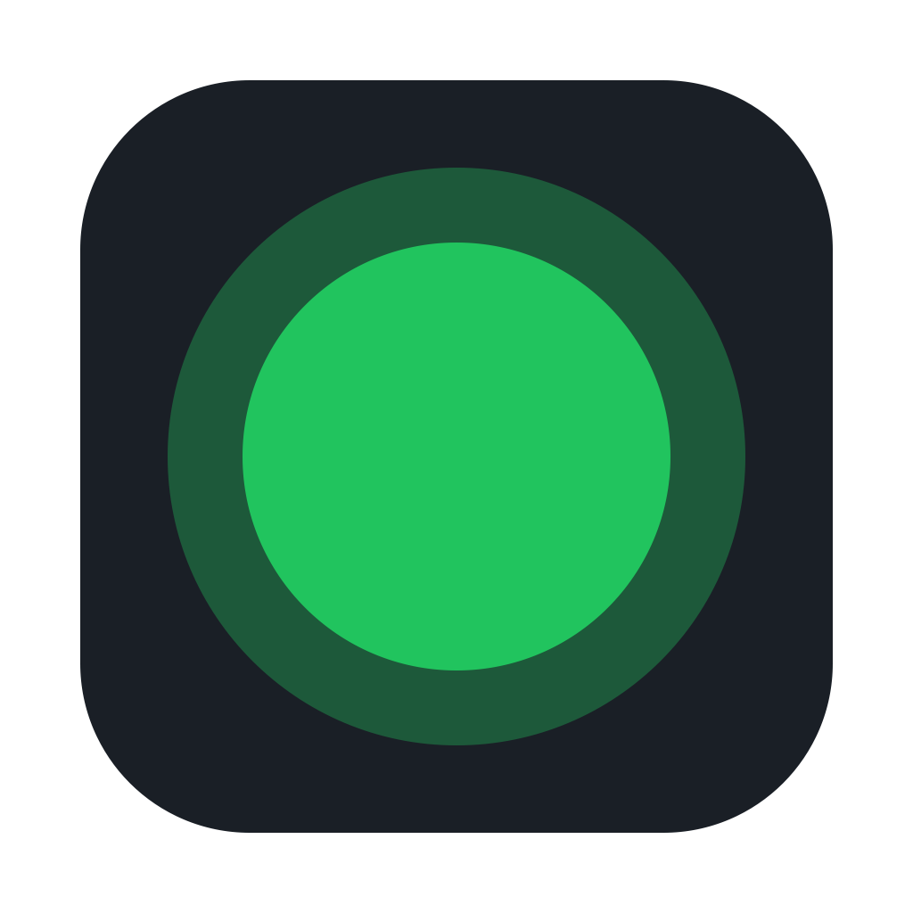

  

<h1 align="center">CapsAwake</h1>

  <strong>MacOS · keep awake · even with the lid closed!</strong>

 

  <b>Caps Lock Key on</b> - Your Mac stays awake 
  <b>Caps Lock Key off</b> - Normal sleep returns

---

### The menu-bar dot shows the state:

- Green - sleep is disabled. The Mac stays awake
- Grey - normal sleep
- Red - something is wrong. Move the cursor over the dot for the reason

### CapsAwake has two parts:

1. **CapsAwake.app** - a small menu-bar app. It reads Caps Lock and the system sleep flag
2. **CapsAwakeHelper** - a small root process. It runs one command: `pmset -a disablesleep 1|0`. This is the only way to keep a closed-lid MacBook awake

The helper runs a watchdog. The app pings it every 30 seconds. If the app dies, the helper restores normal sleep within 90 seconds

## Why it is not on the App Store

The Mac App Store requires a sandbox. A sandboxed app cannot run a root helper or disable system sleep. Apple does not allow this mechanism in the App Store or TestFlight. So CapsAwake ships as a signed and notarized app, outside the App Store

### Safety

A Mac that stays awake gets hot and drains the battery. CapsAwake turns itself off when:

- the battery drops to 15% while unplugged, or
- the Mac is under critical thermal pressure

Turn Caps Lock off, then on, to retry

## License

[MIT](LICENSE)
